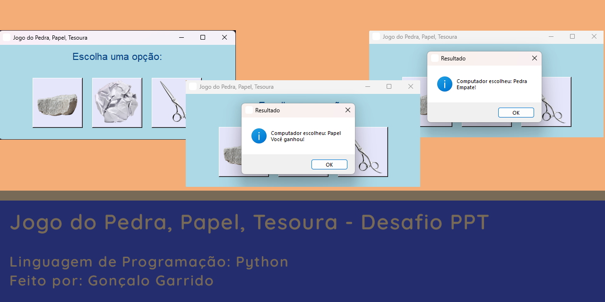
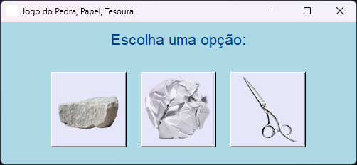
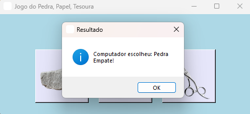
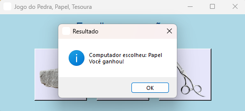

#  <br>Desafio PPT



Aplicação em Python para jogar Pedra, Papel, Tesoura, com interface gráfica e imagens para uma experiência mais visual e interativa.

## Descrição

O projeto **Desafio PPT** é uma aplicação interativa que permite ao utilizador jogar o clássico jogo Pedra, Papel, Tesoura contra o computador. Com uma interface gráfica criada em `tkinter`, o utilizador pode escolher a sua jogada clicando em imagens que representam as opções. Este projeto ajuda a praticar conceitos de GUI com Python, manipulação de imagens e lógica de programação.

## Funcionalidades

- [x] Interface gráfica amigável para jogar.
- [x] Carregamento de imagens redimensionadas para uma melhor visualização.
- [x] Mensagens de resultado indicando o vencedor.
- [x] Ícone personalizado para a aplicação.

## Tecnologias Utilizadas

- **Linguagem de Programação**: Python
- **Bibliotecas**:
  - `tkinter` para interface gráfica.
  - `Pillow` para manipulação e redimensionamento de imagens.
  - `random` para a escolha aleatória da jogada do computador.
- **IDE**: Visual Studio Code

## Prints de Tela

Visuais -> [Ver Agora](./Docs/Pages/Visual.md)

| Print 1 | Print 2 | Print 3 |
|---------|---------|---------|
|  |  |  |

## Como Utilizar

1. **Instale as dependências**:
   Certifique-se de ter `Pillow` instalado:
     ```bash
     pip install pillow
     ```

2. **Clone o repositório**:
   ```bash
   git clone https://github.com/ProjetosLendarios/Desafio-PPT.git
   cd desafio-ppt

## Autor
<br>
Nome: Gonçalo Garrido <br>
Email: Goncalosantosgarrido+LearningProgram@gmail.com<br><br>
[](https://goncalogarrido2.github.io/GoncaloGarrido/)

